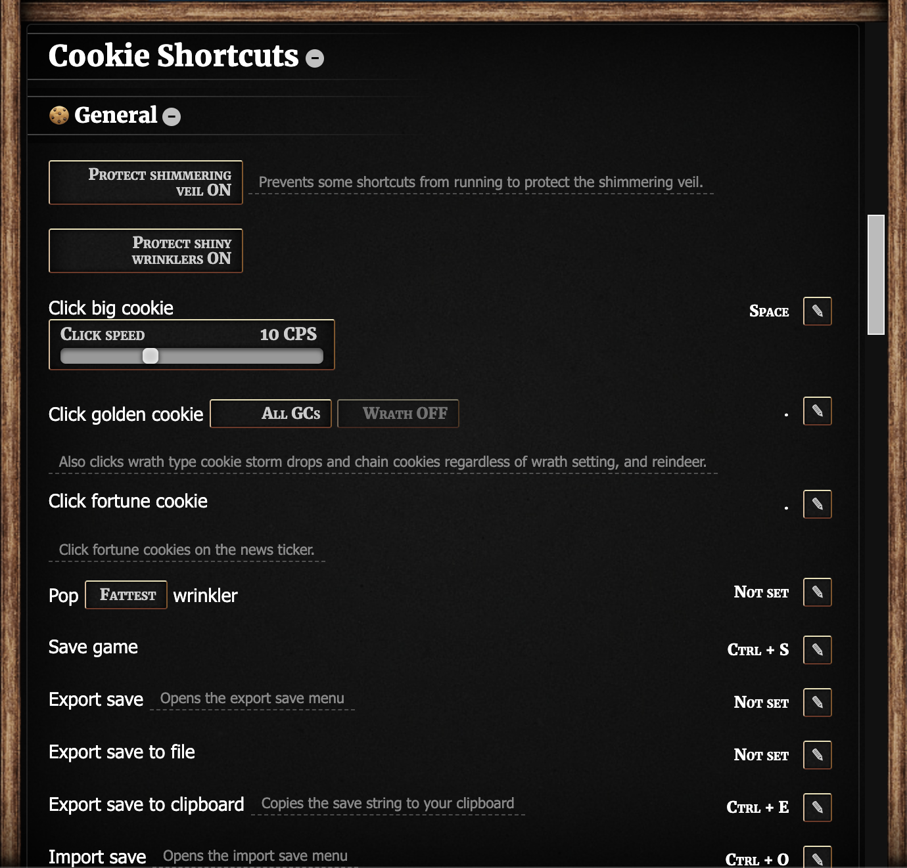
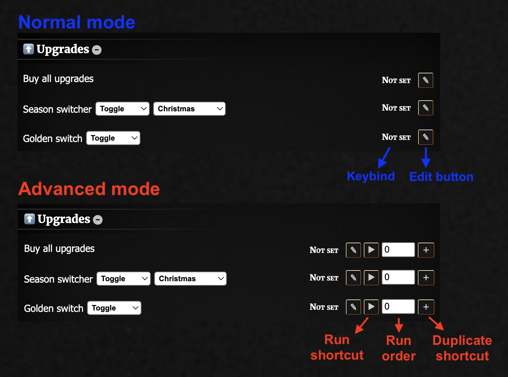

# Cookie Shortcuts

A keyboard shortcuts mod with 40+ fully customisable keyboard shortcuts.



Compatible with Cookie Monster.

## Shortcuts

Shortcuts include:

**General**

-   Click big cookie / golden cookies / fortune cookies
-   Pop wrinklers
-   Ascend/reincarcenate
-   Export save to file/clipboard

**Upgrades and Buildings**

-   Buy/sell any amount of buildings
-   Buy all upgrades
-   Switch season
-   Toggle golden switch / shimmering veil

**Minigames and Krumblor**

-   Harvest/plant garden crops
-   Buy/sell stock market goods
-   Take loans
-   Swap Pantheon gods
-   Cast Grimoire spells
-   Set Krumblor aura

...and more

## Shortcut combos



Shortcut combos can be created in advanced mode. Assign the same keybind to multiple different shortcuts and change their run order to make them run in order at the same time when a shortcut is pressed. The shortcut with the lowest run order runs first.

**Things you can do with one combo:**

-   Doublecasting: Cast FTHoF, sell a precise amount of wizard towers, cast FTHoF again, click all golden cookies spawned, buy back all wizard towers
-   Slot Godzamok in diamond, sell multiple buildings to activate buff then slot Molkalsium in diamond
-   Endless cycle: Ascend while skipping the menu and animation, reincarcenate and buy all upgrades

## Installation

### Userscript

Paste [this userscript](./userscript.js) in a new script in your preferred userscript manager.

### Bookmarklet

Save this code as a bookmark.

```js
javascript: (function () {
    Game.LoadMod("https://mastarcheeze.github.io/cookie-clicker-mods/cookieshortcuts/main.js");
})();
```

### Manual load

Paste this code into your console.

```js
Game.LoadMod("https://mastarcheeze.github.io/cookie-clicker-mods/cookieshortcuts/main.js");
```
