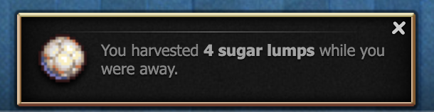
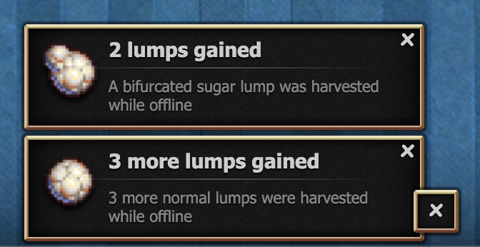

# What Lump Did I Harvest

A mod that changes the 'You harvested _n_ sugar lumps while you were away' notification to be more helpful.

Vanilla:



What the mod does:



Note: The mod will not work the first time it loads because it does not have the information of the harvested lump saved. Subsequent loads will work normally.

## Installation

[Source code](./main.js)

### Userscript

Paste [this userscript](./userscript.js) in a new script in your preferred userscript manager.

### Bookmarklet

Save this code as a bookmark.

```js
javascript: (function () {
    Game.LoadMod("https://mastarcheeze.github.io/cookie-clicker-mods/whatlumpdidiharvest/main.js");
})();
```

### Manual load

Paste this code into your console.

```js
Game.LoadMod("https://mastarcheeze.github.io/cookie-clicker-mods/whatlumpdidiharvest/main.js");
```
